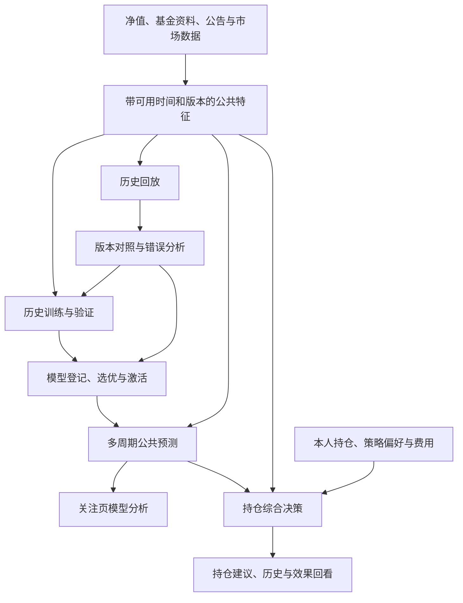

# 基金多周期预测与持仓综合决策实施方案

版本：V1.0。编写日期：2026-09-22。本文是实施设计，**功能实际状态以进度页为准**。初版交付仅包含文档，没有执行新训练、模型切换、数据库迁移或业务代码发布。

适用仓库：Vue `C:\WebStormProject\workSpace05`、Java `C:\ideaProject\workSpace12`、Python `C:\pythonProject\workSpace06`。

阅读入口：先看[白话阅读版](fund-prediction-holding-decision-plain-guide-2026-09-22.md)，其中用例子解释第 4.2 节以后的业务含义；本文保留接口、字段、算法和验收细节，供开发实施。

**查看当前进展：[实施进度与每步完成标志](fund-prediction-holding-decision-progress-2026-09-22.md)。** 35 个实施步骤分别记录状态、完成条件、证据和时间；第 14 节另维护 22 项验收结果。文档准备、功能完成与长期效果观察分开统计。

本文汇总本轮用户已明确的目标、当前代码核对结果、实施顺序和验收标准，作为下一阶段实施入口。旧研究报告保留原时点结论；旧文件中的“三只基金限定”“未正式发布就不能参与建议”“固定旧模型不替换”等约束，在本文所述实验功能范围内由本轮用户要求替代。真实数据、时间顺序、账户隔离及历史不可篡改要求继续有效。

## 1. 已确认目标与交付边界

### 1.1 两处页面分别负责什么

| 位置 | 回答的问题 | 展示内容 | 范围 |
| --- | --- | --- | --- |
| 我的关注 → 模型分析 | 这只基金在不同未来周期预计如何表现？ | 周期、起止日期、预计方向、简明依据；展开可查模型与数据版本 | 全部本人关注基金，不要求持仓、不要求个人实验订阅 |
| 持仓详情 → 持仓建议 | 综合当前信息，现在适合怎样操作？ | 买入、加仓、继续持有、减仓或卖出中的明确结论，以及支持/反对依据、有效时间 | 本人持仓；准备买入基金可通过明确入口进入同一决策能力，不把建议混回模型分析卡 |

五日、十日、二十日、三十日、半年、一年、两年、三年是用户举例，**不是必须一次实现的周期清单**。每个实际开放周期都必须有对应目标、推理、保存和核验能力。

短线、中线、长线是可选的个人策略偏好，属于持仓建议；不作为关注页预测的前置条件。没有填写时使用明确标注的默认实验策略，不虚构用户风险承受能力。

### 1.2 必须兑现的行为

1. 全部关注基金进入任务范围，删除固定三只基金及仅股/混/债的产品准入白名单。按基金实际数据和日期规则计算；类型没有专门模型时使用登记过的通用实验基线。
2. 测试阶段给出明确预测和操作判断。模型分数接近分界、尚未证明稳定优势、缺少非必要因素，不作为拒绝判断的理由。
3. 真正无法计算时保存失败，给出具体原因、缺少内容、失败步骤和可采取的处理方式。失败不是“继续持有”，也不是一种投资结论。
4. 找到按固定评价规则更优的可运行模型后，自动进入实际实验预测；保留切换理由、在用版本、真实推理回执及回退能力。
5. 历史训练、验证、策略回放与每天真实预测并行。历史补算、当日真实预测、到期核验分开统计。
6. 持仓金额不改变基金走势判断。金额、仓位、成本影响个人操作规模与执行条件，不能因为持有金额小而拒绝生成建议。
7. 不恢复已经移除的 Java 一日总开关和个人“每日实验”订阅限制。账户认证、本人数据归属和管理员操作权限仍由服务端执行。

### 1.3 范围限制与保守默认

- 本阶段覆盖“全部关注基金”，不扩成对全市场所有基金无差别预测。
- 生成建议和模拟回放，不对接真实下单、不自动交易。
- 复用现有 Java/Spring、Python/FastAPI、Vue、PostgreSQL 和同步任务架构，不引入新的模型平台、消息中间件或付费服务作为前置条件。
- 新数据优先核验现有源与授权范围。新增费用、账户接入或真实第三方写入另行提出；已有数据上的本地开发和实验不反复等待确认。
- 本文的实验参数是可直接起步的版本化默认方案，不表示这些参数已经训练成功。未获验证的分数不标成真实上涨概率或正确率。

## 2. 当前实际情况：为什么训练了新模型，页面仍可能用旧模型

### 2.1 本次核对到的三条不同链路

| 链路 | 实际机制 | 带来的问题 |
| --- | --- | --- |
| 关注页二十日实验 | Python `direction_experiment.py` 固定 `MODEL_FILE`、两个 `MODEL_HASHES`、`fit_end=2024-03-31`，并限定三只基金 | 新产物不会自动进入这条推理链；只有写训练报告不会改变页面 |
| 当前持仓建议 | Java `AdvicePolicy` 取上述实验结果，第一个模型分数大于 0.5 则 HOLD，否则 SELL；参考模型只作对照 | 依赖固定二十日模型，经理、新闻等不会自动成为综合决策输入 |
| 一日页面实验与一日研究 | 页面 `direction_1d_inference.py` 从 `direction_1d_model` 读取，按初始 cohort 和时间资格锁定 FIXED/WEEKLY；R122 属于单独研究运行链 | 页面已有有限登记机制，但没有按研究成绩选优并完整接入任意新特征/新算法的统一流程 |

一日代码中的 FIXED 取同 cohort 最早合格版本，WEEKLY 取最新合格版本；这不等于按效果挑选最优版本。仅存在研究文件、训练成功、Windows 研究任务运行成功，都不能证明页面已经采用。

R122 研究记录记载：2026-09-16 完成新训练和独立 40 分支研究入口接入；历史开发结果仍未证明稳定改善。因此“新模型完全没有运行过”也不准确。**研究链运行、页面主结果采用、持仓规则采用，是三个需要分别验收的事实。** 本次没有重新核对这些 Windows 任务当前是否仍在运行。

### 2.2 之前没有替换的两类原因

1. 研究条件：一些新候选仅在部分时期提高，扩展样本后优势消失，或者旧报告约定不自动发布。不能据此声称“已证明优秀却一定被漏用”。
2. 工程缺口：二十日页面绑定固定产物，一日研究与页面登记没有统一打通，缺少“选优 → 登记 → 激活 → 真实调用 → 页面回读”的完整验收。

本轮修正：**允许证据尚在积累的模型用于明确标注的实验功能；长期有效的证据等级不能成为实验采用的永久障碍。** 仍保留同题比较与时间正确性，不把“训练得更新”直接等同于“表现更好”。

### 2.3 已有能力与缺口

| 能力 | 已有基础 | 本阶段增量 |
| --- | --- | --- |
| 一日预测同步 | 已移除两类开关，加入“全部关注基金预测”和一键同步 | 接入多周期及通用基线，增加周期级进度与失败详情 |
| 模型研究 | 多轮训练、评估、复现及本地产物 | 统一产物登记、适配器、选优、激活和回退 |
| 预测输出 | 一日留档；二十日封存模型实时试算 | 全关注、多周期、不可变结果及统一历史 |
| 持仓诊断 | 经理、规模、同类、基准、回撤、费用、分红等代码 | 接入综合决策，补充经理任职/经验等事实口径 |
| 规则 | 草案、确认和版本记录 | 通用实验策略可直接使用；用户已确认规则明确覆盖相应默认参数 |
| 建议回看 | 原建议留档及后续二十日回报 | 含费用、成交与再次买入的连续策略回放 |
| 新闻公告 | 当前建议保留扩展位置 | 经实际源核验后分阶段接入；未接入不得写成已分析 |
| 错误展示 | 部分业务原因已返回 | 结构化错误链、逐基金逐周期失败、重试和旧结果标记 |

上述为源代码和已有报告核对；基金数量、任务运行状态和模型登记数量不作为本次实时数据库结论。

## 3. 总体结构与职责



| 层 | 职责与保存内容 |
| --- | --- |
| Python | 公共数据、时点特征、模型训练与公共预测回放、模型产物与激活记录、预测及客观到期标签；不读取个人账本 |
| Java | 登录授权、本人关注范围、个人持仓与策略、综合决策、建议留档、连续持仓策略模拟、浏览器接口和跨服务协调 |
| Vue | 分开的模型分析/持仓建议页面、同步任务、失败详情、历史、版本与效果展示；不在浏览器重新算建议 |

综合决策实现为 Java 可测试的纯计算组件：输入事实快照、预测快照、持仓状态和策略版本，输出结论与依据。每日真实建议与历史持仓回放调用**同一实现**，不维护第二份含义相近的 Python 买卖规则。

预测模型实验由 Python 负责；持仓策略参数搜索可由 Java 回放任务调度同一决策组件完成，公共预测按基金/历史批次向 Python 取得。回放采用虚拟组合或本人授权的模拟持仓，个人身份与实际金额留在 Java。

## 4. 全关注与多周期预测契约

### 4.1 周期目录

建议第一批新增 `T5`、`T20`、`M6`，保留既有一日实验历史。它们是实施默认起点，不是用户已经确定的最终周期数量。

| 字段 | 定义 |
| --- | --- |
| `horizon_id` | 版本化标识，如 `T5_V1`、`T20_V1`、`M6_V1` |
| `unit` / `length` | `TRADING_SESSION` / 5、20，或 `CALENDAR_MONTH` / 6 |
| `calendar_policy_id` | 基金净值估值日历、时区和非估值日顺延规则 |
| `target_definition_id` | 收益/方向标签、起止净值及分红处理的精确定义 |
| `feature_schema_version` | 输入字段、单位、缺失处理和计算窗口版本 |
| `enabled_from` | 本周期开始真实生成的时间，不补造过去已生成记录 |

后续增加十日、三十日、一年至三年，通过周期目录与目标适配器扩展。半年不能简单显示成“120 个交易日”；自然月使用日历加月，再按该基金估值日规则顺延。

### 4.2 目标日期与收益口径

白话解释：先约定“从哪天观察到哪天、分红算不算、最后怎样判断涨跌”，再按这个约定训练和核验。这里的公式是统一计算方式；具体例子见[白话版第 1 节](fund-prediction-holding-decision-plain-guide-2026-09-22.md#1-第-42-节先说明预测多久怎样算预测对了)。

- 新多周期默认目标：**从下一可执行估值日 S 到目标日 E 的现金分红再投资总回报方向**；交易日周期 `E=advance(S,H)`，自然月周期 `E=rollForward(addMonths(S,M))`。训练标签使用同一定义。S 的净值尚未知是正常情况，它属于将来结果而非输入。
- S 由生成时刻、基金交易截止规则和估值日历确定。输入仅使用生成时刻前可知内容；页面同时展示输入净值截至日 D、观察起点 S、目标日 E，避免把陈旧净值日期当成当前日期。
- 旧一日目标是下一估值日单位净值上涨/非上涨，旧二十日也有自身锚点；以原 `target_definition_id` 保留，不改名后混入新统计。
- 总回报标签 `R = reinvested_value(E) / reinvested_value(S) - 1`；严格大于零为 UP，小于等于零为 NON_UP，实际零回报另外统计。页面解释为“预计上涨 / 预计下跌或持平”。
- 若未来增加回报点估计、区间或概率，必须配套训练目标、校准及评价；首版不把方向分数转换成收益率。
- 多周期不是复制二十日分数。每个周期登记独立目标和模型路由；可共享算法、部分特征和数据读取。

远期官方日历尚未公布时，半年/年周期先保存名义到期日、顺延规则和 `end_date_status=PENDING_OFFICIAL_CALENDAR`，允许按周期模型生成方向；页面明确日期待官方日历确定。日历公布后追加目标日期解析事件，用原规则得到 E，不回改原始预测。它与缺少当前估值日历、无法确定输入或 S 的计算失败不同。未来拓展多年周期时沿用这一机制，不要求现在就存在未来三年的已公布日历。

### 4.3 全部基金如何获得结果

路由顺序：`该资产组/周期的当前实验模型 → 该周期通用训练模型 → 登记的通用规则基线`。

通用基线 `NAV_MOMENTUM_BASELINE_V1` 起步定义：在同一总回报输入口径上，取该周期对应交易日数与 60 的较小值 N；至少需要连续 20 段有效收益（21 个净值点）。若历史少于 N 段但不少于 20 段，则取实际连续段数并记录降阶；历史累计回报大于零预测 UP，否则 NON_UP。这是确定性的实验参考，分数可为空，不伪装成训练模型或概率。

基线本身也须登记适用周期、输入要求、版本和产物身份，接受同样的历史与真实结果核验。期限较长而历史短时，可以输出基线实验判断并注明局限；不能声称已验证长期能力。

| 基金情况 | 行为 |
| --- | --- |
| 国内股票、混合、债券 | 用匹配路由；可分组共用模型，不规定一类必须只有一个模型 |
| 含港股的境内基金 | 不按基准文字一概排除；特征缺少海外因素时列为未覆盖 |
| QDII | 区分基金净值估值日历、公布时间与底层市场日历；按实际时区对齐 |
| 黄金及其他类别 | 专用模型未完成时使用总回报基线；逐步加入对应资产因素 |
| 净值/日历/分红口径无法建立 | 记录本基金本周期失败，具体说明缺项；其他基金继续 |

资料完整性要求按模型 manifest 声明。不能对所有基金强制要求所有新闻、指数、经理信息齐全；也不能把断档净值线性补造为真实净值。

### 4.4 预测记录

一条预测至少保存：`prediction_id`、基金、周期、目标定义、D/S/E、`generated_at`、`knowledge_cutoff`、模型版本/hash、激活版本、特征快照/hash、方向、原始分数及其含义、简明依据、遗漏因素、是否基线回退、生成任务及错误信息。

`LIVE`、`HISTORICAL_REPLAY`、`RECOMPUTED_AFTER_EVENT` 明确分开。真实预测到期前完成生成并保存服务端时间；重跑历史不能冒充提前预测。

公共预测按基金共享，用户关系由 Java 关联。统计分别报告去重基金数、基金×周期任务数、结果数和独立行情日数，不把多模型、多份额、多周期累加成基金数量。

## 5. 模型选优、采用与回退：必须进入实际调用

### 5.1 两个独立状态轴

模型运行角色：`REGISTERED`（已登记）、`SHADOW`（并行生成候选结果）、`ACTIVE_EXPERIMENTAL`（页面当前实验主模型）、`RETIRED`（停止新调用但历史可复核）。

证据等级：`DEVELOPMENT_ONLY`、`OUT_OF_TIME_TESTED`、`FORWARD_OBSERVED`；同时保留样本规模、评价区间和数据假设。运行角色与证据等级分开，`DEVELOPMENT_ONLY` 可以用于实验页面，不能因此标成长期有效。

### 5.2 模型包要求

每个包必须包含：算法/推理适配器、特征顺序与单位、缺失处理、标准化参数、决策阈值、资产组、周期和目标定义、训练标签实际截止、训练完成时间、代码和依赖版本、产物 hash、评价报告及适用日历。

`trained_at` 不代替 `label_end_max`。用旧行情重新导出文件，不能显示成“已用最新行情训练”。禁止按目录修改时间选择版本。

选定模型配方后，用截至当前已成熟标签重新拟合时生成新的 model_id/hash，登记其继承的配方与选优报告；不能把历史验证模型的成绩说成这份新权重已经获得真实未来成绩。新产物仍须完成复现/预加载和采用回执，实际特征构建必须使用与训练相同的公式与单位。

原 `.local-runs` 产物可作为导入来源，登记时复制到配置的持久化模型目录，生成不可变 manifest；清理研究临时目录不能让当前模型消失。模型目录不含密钥，不把原始私有数据或模型大文件直接提交 Git。保存部署/备份清单和恢复步骤。

新算法使用受控适配器，不能把树模型 JSON 交给旧线性打分函数。对不可安全解释或依赖不完整的包记录 `MODEL_PACKAGE_INCOMPATIBLE`，修复适配器后重试。

### 5.3 什么叫“更优秀”

比较单元为 `(目标定义, 周期, 资产组, 输入资格/评价协议)`；不能拿一日准确率替换二十日模型，也不能拿不同基金集合的最高分直接比较。

第一版选优协议 `EXPERIMENT_SELECTION_V1`：

1. 事先冻结候选清单、训练/调参/选优时间段、主指标与备选规则。当前模型和候选在相同日期、相同基金及相同可得数据下重算。
2. 预测主指标为按日期、产品家族聚合的方向准确率；同时报告普通基金题准确率、平衡准确率、各类召回、基金/时期拆分和覆盖率。权重在评分前固定，不按结果改。
3. 候选在固定选优区间的主指标严格更优、覆盖率不降低，且通过运行和时间正确性检查，就可自动成为实验主模型。初版分数比较容差 `1e-8`，容差内优先运行成本更低；仍相同时优先同配方中训练标签更新的版本，最后按版本号确定。规则每次变更另存版本。
4. 不要求每只基金、每个季度都改善，不设置 80% 门槛，不要求统计显著或先等待半年真实成绩才实验采用。样本少、部分时期退步和选择偏差必须随比较报告展示。
5. 没有严格更优者时，保留当前主模型，同时让有研究价值的候选进入真实并行预测；首版最多 3 个候选/路由，超过时按已冻结排名和资源预算轮换。候选不能停留在“已训练但从未调用”的状态且没有原因。
6. 持仓策略版本另作比较：默认先要求覆盖不降低、最大回撤较当前策略恶化不超过 **2 个百分点**，再按同区间扣费后累计收益排序；同收益选择换手更低者。2 个百分点仅为 `STRATEGY_SELECTION_V1` 的起始实验容差，不是用户风险偏好或已验证最优值。同步展示一直持有、当前策略和候选的完整结果。

每次结论必须为明确的 `ACTIVATE`、`KEEP_CURRENT`、`RUN_AS_SHADOW` 或 `BLOCKED_TECHNICAL`，并记录理由。不得只写“尚未正式发布”结束流程。

多年反复使用的数据属于开发资料。可以基于它选择“当前开发表现更好的实验版本”，但必须标注证据等级；独立测试区间一旦用于反复调参或选优，就登记为已使用，后续启用新的时间段评价。长期收益结论与实验切换分别管理。

### 5.4 自动激活流程


- 默认在训练评价完成后触发选优；满足协议即自动更新实验路由，不增加逐模型人工批准步骤。
- 激活前进行完整性、输入兼容、可复现、有限耗时和真实特征快照上的试推理检查。它们是防止计算错误的检查，不是要求模型先证明高准确率。
- PostgreSQL 事务按路由键锁定，使用版本号 CAS 更新，记录旧版本、新版本、比较报告、原因、操作来源和生效时刻。
- 每个任务启动时锁定 `activation_revision`，同一批次不混用切换前后模型；新激活影响下一新批次。若已有同一期结果，保留原文，可追加“新模型重算版本”，不能覆盖首份预测或重复计为独立成功样本。
- 第一次合适的真实生成窗口必须完成 `登记版本 → 路由版本 → 推理返回版本 → 保存版本 → Vue 展示版本 → 持仓输入版本` 核对。窗口尚未到时状态为“已配置，待首个真实推理回执”，不能宣称已经用起来。

### 5.5 回退与停用

- 新模型包缺失、hash 不符、依赖不兼容或同一批次健康检查失败时，记录激活失败/回退事件，改用上一可运行版本；仍不可用时尝试登记基线。
- 单只基金缺某个扩展特征时按 manifest 的降阶路由处理，不因一只基金缺数据全局回退。
- 回退结果携带 `requested_model_id`、`actual_model_id`、`fallback_reason`，页面历史可查，不能声称仍在使用新模型。
- 单次预测错误不触发即时换模。效果变差只在固定的选优周期用已成熟结果重新评估，避免每天追逐噪声。
- 旧版本不删除；回退不改写历史建议和历史统计。不得因回退重新启用个人订阅门槛。

### 5.6 在用模型看板

管理员可按周期/资产组查看：当前主模型、真实训练标签截止、激活时间、实际成功调用时间与数量、旧模型、比较结果、候选状态、未采用原因和回退历史。

用户主卡只展示结果和依据，版本详情放展开区。运营验收必须用真实返回的模型身份，不能通过修改显示名称伪装采用。

## 6. 数据与特征：既支持当前建议，也支持可信历史回放

### 6.1 特征接入分层

| 层次 | 内容 | 实施方式 | 缺失处理 |
| --- | --- | --- | --- |
| 计算基础 | 基金标识、净值、日历、目标收益所需分红/拆分信息 | 复用已有表，补可用时间、版本和日历覆盖 | 无法建立目标或输入时该任务失败 |
| 第一批综合因素 | 多周期预测、趋势、波动、回撤、经理变更/任职、规模、基准、同类、费用、分红 | 优先接通已有诊断；核实经理从业年限是否有来源 | 非必要项缺失仍给实验建议，列明未使用项目 |
| 第二批扩展因素 | 基金公告、管理人公告、持仓行业、市场和底层资产、宏观/利率/汇率 | 逐源核实权限、频率、日期和历史覆盖，再做增量接入 | 不伪造事实；其他来源继续 |
| 第三批研究因素 | 新闻情绪、事件关联、多源信息冲突、风格漂移等 | 小批可复现研究与消融对照，通过后登记版本 | 没有增量证据也保存研究结果，不强行加入主策略 |

经理“从业年限”“担任基金经理年限”“管理本基金年限”分别命名，不能由姓名或单条任职记录推算不存在的履历。经理变更是事实，不能自动等同于利空。

基金份额与资产规模分开，货币单位统一保存；历史相对净值位置不等同于底层资产估值。新闻有无、新闻情绪、事件对基金的关联度也必须分开。

### 6.2 时间与版本字段

公共事实统一保留：`source_id`、`source_record_id/url`、`effective_at`（事件生效）、`published_at`（来源公开）、`first_observed_at`（本系统首次实收）、`revision_at`、`payload_hash`、`quality`、原始单位及标准化值。

历史输入质量分三类：

- `OBSERVED_AT_TIME`：有当时实际接收的不可变证据，可用于严格真实前向核验。
- `RECONSTRUCTED_PUBLICATION`：现在获取历史资料，但有可核验的原始公开时间和版本，历史回放使用其公开时间；仍标明重建性质。
- `ASSUMED_AVAILABILITY`：只能采用“下一交易日可用”等假设；单独形成研究分组，不与严格实收证据混算。

真实预测要求输入在 `knowledge_cutoff` 前实际可得。历史回放要求事件当时已公开，并限制为当时那个版本；不能因为今天下载了历史资料，就伪造过去本系统已实收。

对净值修订、经理资料修订和公告更正追加版本；回放引用版本快照。当前 `fund_profile` 等覆盖式快照不能直接用于过去所有日期，从实施日起开始留历史，并按能够核实的源重建更早资料。

### 6.3 新闻公告接入契约

每条证据保存发布/抓取时间、来源链接、标题、相关基金/资产、关联规则、事实摘录、事件类别、方向解释及有效期。相同公告多站转载只计一次；同一事件多条新闻合并，避免重复加权。

文本分析可生成结构化事件和简明解释，但必须引用实际资料；外部文本不能修改任务指令、执行工具或自选模型版本。未授权的数据源不自动接入。先交付来源覆盖表和一组真实样例，再批量采集。

### 6.4 特征有效性检验

每增加一组因素，用同一数据切分比较“原方案”和“仅加该组因素”，报告正负增量及覆盖变化。历史资料缺失时，区分全范围基线与共同样本比较，不通过删除难预测基金制造提升。

## 7. 持仓综合决策

### 7.1 输入和输出

输入：公共事实快照、多周期预测引用、当前模拟持仓及批次成本、费用/交易规则、可选个人策略、已确认个人规则、决策版本与生成时刻。

输出：`decision`、`summary`、`supporting_evidence`、`opposing_evidence`、`missing_optional_factors`、`strategy_version`、`model_refs`、`position_snapshot_id`、`valid_until`、`execution_constraints`、是否采用默认实验配置。

| 持仓状态 | 有效操作结论 |
| --- | --- |
| 已持有 | ADD、HOLD、REDUCE、SELL，即加仓、继续持有、减仓、卖出 |
| 未持有且属于本人关注/准备买入范围 | BUY、AVOID，即建议买入、不建议买入 |
| 必要数据失败 | `generation_status=FAILED`、`decision=null`，展示“本次建议生成失败”及原因 |

“继续持有”必须有模型或规则形成的正向判断，不用于遮盖运行失败。没有新闻不等于没有风险；缺少可选信息不自动拒绝判断。

### 7.2 第一版可执行的组合规则

实现 `HOLDING_ADVICE_V2_EXPERIMENTAL`，保留 V1 历史。先使用透明、可复算的规则组合，再以回放结果优化权重/阈值，不把大模型自由生成的解释当成未经记录的交易规则。

起步配置如下，所有数值属于待验证的实验默认值：

1. 多周期预测分别映射为方向信号 `+1/-1`；按策略选定的周期权重取平均。默认均衡策略使用 T5/T20/M6 权重 `0.2/0.5/0.3`，未开放周期不参与，并记录实际可用权重。短/长偏好使用独立版本配置，不改关注页预测。
2. 趋势/风险、基金事实/事件各生成 `[-1,1]` 范围的可解释因子。每个因子必须有固定公式或事件规则、来源和版本；只知道“经理更换”而不知道影响时，该项数值为中性，并保留事实。
3. 起步综合分为 `0.6 × 模型方向信号 + 0.2 × 趋势风险因子 + 0.2 × 事实事件因子`。非必要因子不可用时贡献为 0，另记可用权重；不能把缺失解释为有利事实。至少有一个可计算预测/基线；否则尝试第 4.3 节基线，再失败则给具体错误。
4. 已持有：`S > 0.7` 为加仓，`0 < S <= 0.7` 为继续持有，`-0.7 < S <= 0` 为减仓，`S <= -0.7` 为卖出。无持仓：`S > 0` 为买入，否则不建议买入。分数恰为 0 也有固定结果，不进入“信心不足”状态。
5. 个人成本/仓位用于操作规模与执行约束，不修改公共预测；短中长期偏好影响周期权重。用户已明确确认的持仓约束优先于默认配置，冲突时在依据中说明触发的具体规则。

输入因子未训练成熟不阻止实验使用；必须记录因子的来源及初始规则属性。上述默认值用于让完整链路先可运行，不能被文档描述成已经优于 V1。

因子计算也要落到版本化配置。第一版趋势风险因子可采用“近 20 日总回报方向”和“当前回撤较此前 20 日是否扩大”的等权信号；零变化记 0，缺任一计算所需历史则该子项不参与，列明原因。事实事件因子只汇总已登记了方向解释的事实规则，起步无可靠方向解释的经理/规模变化保留为正文事实、贡献 0。新增事件规则须明确字段、阈值、有效期、正反向和相同事件去重，不让未定义规则的文字直接改变分数。

### 7.3 金额、交易条件与连续策略

- 基金只有十元持仓也照样输出 SELL/REDUCE 等判断，金额不构成信号门槛。
- 实际不能立即赎回、处于暂停赎回或费用较高时，保留方向判断并说明可执行时间、费用和约束。计算成功但交易受限，不记成模型失败。
- 首版页面可先只展示动作；回放必须有数值化仓位政策。起步采用 `POSITION_POLICY_V1`：虚拟单基金资金相同；BUY 用 50% 可用现金，ADD 用 25% 可用现金，REDUCE 卖出 50% 可卖份额，SELL 卖出全部可卖份额，HOLD 不下单。资金不足或存在未完成同向订单时不重复下单，记录执行原因。
- 这套比例只属于实验模拟配置，不代表用户真实下单授权或个性化最优仓位。将来显示建议比例时也要标注策略版本与约束。
- 卖出后仍对本人关注/策略研究范围内的基金继续判断，允许在未来产生 BUY，避免当前“清仓就停止所有新建议”的链路无法评价买回时机。
- 组合层加入行业集中度、相关资产暴露和现金占比；缺少底层持仓时按已知暴露计算并标明覆盖，不能假装知道完整组合风险。

## 8. 训练、历史回放与真实预测并行

### 8.1 数据分段与实验登记

按时间划分训练、调参验证、固定候选选优、独立测试，并保留从实施日起的真实前向记录。数据不足时可以减少历史窗口形成探索性实验，但如实降低证据等级，不伪造独立测试。

创建实验时先冻结：基金集合/产品家族映射、时间段、目标与周期、特征可用性规则、候选清单、训练次数预算、费用/成交/仓位规则、主指标、比较基线和随机种子。历史上已看过的 2024/2025 等数据按实际使用登记，不能重新命名为全新盲测。

训练集中的每个标签，在拟合时必须已经结束且可知。二十日或半年标签跨入验证区间的训练样本需排除；同一日期所有基金统一分区，避免通过别的基金拿到同日未来行情。预处理、缺失填补、标准化、特征选择均只在训练数据上拟合。

多周期重叠样本按目标区间剔除交叉污染，并按日期/时间块评价不确定性；不能把大量重叠的半年预测当作同等数量的独立半年试验。

### 8.2 两种回放共用时点证据

**预测回放（Python）**：历史时点取可知特征 → 使用在该时点之前已完成拟合的模型 → 保存预测 → 读取到期标签 → 计算指标。若现有模型是用后来的数据训练，就按历史切分重新训练，不能直接拿今天的模型预测过去并称为真实表现。

**持仓策略回放（Java）**：逐估值时点推进 → 批量取得公共特征和当时可生成的模型预测 → 调用与当前服务相同的决策组件 → 模拟提交/确认/结算 → 更新现金与份额 → 进入下一时点。策略参数同样不能使用测试区间的结果调好后再回头评分。

同一批次共享特征快照和公共预测，按批次调用，避免每天每基金每因子一次跨服务 HTTP。Java 回放不往真实模拟账户记交易，使用隔离的回放账本。

### 8.3 成交与费用

- 按当时可知的数据生成建议，再应用基金交易截止时间、节假日、净值确认与到账规则。不能先读取当日最终净值，再假装按同日更早时刻下单。
- 买卖费率按基金/份额和持有批次读取；申购、赎回及到账期间现金不可重复使用。管理费、托管费已反映在净值中的部分不重复扣除。
- 分红、再投资、拆分和份额变化使用统一会计口径；对账现金与份额守恒。
- 历史费率无法恢复时允许使用固定且披露的模拟费率做敏感性比较，成绩标为“费用假设下回放”，不声称精确重现历史账户。
- 对照方案使用相同初始资金、可交易日期、净值、费用和现金规则，记录一直持有、当前 V1/V2、候选策略等结果。

### 8.4 评估指标与错误定位

| 层 | 至少输出 |
| --- | --- |
| 预测 | 去重基金数、日期数、题数、覆盖率、成功/失败、方向准确率、两类召回；有概率时才评估校准，有幅度时才评估误差 |
| 策略 | 扣费后累计收益、最大回撤、换手、交易次数、费用、在场/空仓时间、与一直持有的差异；短区间不夸大年化结果 |
| 卖出质量 | 避免的后续下跌、错过的后续上涨、买回时间、净费用影响 |
| 稳定性 | 按基金类型、产品家族、时期、上涨/下跌环境、周期和模型版本拆分 |
| 运行质量 | 数据延迟、失败类型、基线回退、推理延迟、采用版本一致性 |

错误分类至少包含：数据迟到/缺失、日历问题、目标/标签错误、预测方向错误、综合因素错误、仓位/费用/成交问题、执行服务异常。单个错误只能记录现象；用分组对照和因素消融逐步定位原因。

失败样本保留在任务覆盖分母，预测准确率使用成功且已到期可核验样本并同时展示覆盖率；不能将无法计算样本悄悄删除后只报高准确率。当前关注集合的历史回放明确存在“按今天关注名单回看过去”的选择范围，不宣称代表全市场。

### 8.5 每日真实结果怎样反哺

每日固定当前模型/策略版本与输入后，给全部关注基金生成预测；本人持仓生成建议。候选按预算并行记录，原结果不可覆盖。净值到期后附加结果，再进入下一训练/评价批次。

初始调度建议：每天检查标签成熟情况；短周期候选每周做一次限定训练和选优；长周期沿同一调度检查是否有足够新增成熟标签，没有则记录未重训原因。历史新假设可以单独启动有限实验，无需等待下一天。

不用单日对错自动改权重，也不让训练任务阻塞每天正常推理。训练/回放有独立并发预算、取消和断点恢复，当前预测保留更高执行优先级。

## 9. 生成任务、失败原因和手动入口

### 9.1 调度与依赖

- 复用现有约 30 分钟检查机制；实际生成由数据可用时间、周期期次和幂等键决定，不把每轮检查都计为新预测。
- 旧一日真实提前预测窗口继续按原协议校验，超时不能补造。当用户白天手动生成新多周期预测时，以当前真实时刻及下一可执行估值日建立新期次，不要求只能在旧一日窗口点击。
- “全部关注基金预测”任务扩展为全部已开放周期；同步中心保留独立按钮和一键同步入口，单基金页可生成当前基金各周期。
- 完整一键顺序：公共数据/公告等增量（按已接入源）→ 净值/日历 → 特征 → 多周期预测；费用/交易规则在持仓建议依赖前就绪 → 持仓建议 → 已成熟结果核验。模型训练另设研究任务，不把耗时训练强行塞入每次一键同步。
- 任一非必要来源失败，继续使用已有合格输入并标明来源时间；必要依赖失败只影响关联项，其他基金/周期继续。

### 9.2 任务与结果状态

任务状态：`QUEUED/RUNNING/SUCCEEDED/PARTIAL_SUCCESS/FAILED/CANCELLED/INTERRUPTED`。基金周期项结果分别为新生成、复用已有、基线回退成功、失败；基线回退是成功结果的属性，不能重复加入总数。

守恒关系：`plannedItems = createdItems + reusedItems + failedItems + cancelledItems + pendingItems`，其中 `pendingItems` 包括排队和执行中。完成任务的 pending 必须为零；`fallbackItems` 是 created/reused 的子集。空关注集合正常结束，说明计划数为零。

批次保存去重基金数及基金×周期数；各用户关注同一基金共用公共结果，但个人建议仍按本人持仓生成。不存在个人订阅才纳入任务的条件。

### 9.3 结构化失败契约

```json
{
  "generationStatus": "FAILED",
  "decision": null,
  "error": {
    "code": "NAV_HISTORY_INSUFFICIENT",
    "stage": "FEATURE_BUILD",
    "summary": "历史净值不足，无法计算本期预测",
    "details": {"requiredPoints": 21, "actualPoints": 12},
    "retryable": true,
    "nextAction": "补齐净值后重新生成",
    "traceId": "example-trace-id"
  }
}
```

上例仅为契约示例，不是现场失败数据。错误中不返回 Token、连接串、原始内部堆栈或个人隐私。

| 错误码示例 | 页面必须说明 |
| --- | --- |
| `NAV_HISTORY_INSUFFICIENT` / `NAV_GAP` | 需要/实际点数，缺少日期范围 |
| `CALENDAR_RANGE_MISSING` | 哪个基金/市场日历，缺少哪个日期范围 |
| `UPSTREAM_TIMEOUT` / `UPSTREAM_UNAVAILABLE` | 哪个依赖失败、是否可重试；有已知状态码时记录 |
| `MODEL_PACKAGE_MISSING` / `MODEL_HASH_MISMATCH` | 实际模型版本、包缺失或校验失败、是否已回退 |
| `FEATURE_SCHEMA_MISMATCH` | 需要与实际特征版本；不能静默套用旧字段顺序 |
| `EVENT_ADJUSTMENT_UNRESOLVED` | 哪项分红/拆分资料影响总回报计算 |
| `PREDICTION_WINDOW_CLOSED` | 对应期次已截止；可生成下一有效期次或历史回放 |
| `INFERENCE_ERROR` | 推理步骤及 TraceID，后台保留实际异常链 |

同一错误保留首次失败、最近失败、尝试次数及每次尝试记录。网络超时/暂不可用最多自动重试 2 次并退避；身份错误、参数错误、模型 hash 错误不盲目重试。写入超时先用幂等键查询是否已保存，再决定是否重新提交。

图中“交易日历暂时无法读取”在当前 Java 代码里存在捕获异常后只留通用说明的路径。实施时要保留底层错误码、请求号与原因，再映射为用户可读内容；不能从截图推断实际根因。若暂时只能定位到服务不可用，明确到这一级，不编造超时或缺失日期。

### 9.4 页面失败处理

显示“本次预测生成失败”或“本次建议生成失败”、原因、时间及重试入口。上次成功结果可保留，但单独标注其生成日期、输入日期和本次更新失败；不能让旧结果看起来刚刚生成。

只有部分周期失败时，成功周期继续显示。任务详情可按基金、周期和原因筛选，支持仅重试失败项。主卡不再把运行失败包装成“暂无操作建议”或“暂不调整”。

## 10. 数据模型与一致性设计

以下为拟新增或扩展的数据契约，不表示表已存在。沿用 PostgreSQL；Java 表由现有 Flyway 管理，Python 表沿用该仓库现有迁移机制。实施时核实最新迁移序号，不能预占已使用版本。

| 归属 | 实体/建议表名 | 核心字段与约束 |
| --- | --- | --- |
| Python | `prediction_horizon` | 周期、目标、日历政策及版本；版本后配置不可覆盖 |
| Python | `model_artifact` | model_id、recipe_version、训练标签截止、产物位置/hash、特征/目标/适配器版本、状态与证据等级 |
| Python | `model_evaluation` | 实验/模型/切分/样本集合 hash、指标、数据质量、比较报告；成绩不可原地修改 |
| Python | `model_activation_event` | 路由、旧/新模型、revision、生效时间、采用协议/理由、回退关系 |
| Python | `model_route` | 路由当前指针及 revision；路由键唯一，原子 CAS 更新 |
| Python | `feature_snapshot`（复用/扩展） | 基金、知识截止、schema、原始来源版本、可用性质量、特征/hash |
| Python | `fund_prediction_record` / `prediction_outcome` | 不可变预测与独立到期结果；预测、重算、回放模式分开 |
| Java | `prediction_user_link` | 本人可访问的公共预测引用；user_id/fund_code/prediction_id 唯一 |
| Java | `portfolio_advice_report`（扩展） | 原 V1 保留；新增 generation_status、策略版本、多周期引用、动作及失败结构 |
| Java | `portfolio_strategy_version` / `user_strategy_preference` | 通用规则版本与可选个人偏好；默认来源明确，个人配置独立隔离 |
| Java | `strategy_replay_run` / `strategy_replay_trade` | 研究配置、虚拟账户、逐步成交、净值曲线和指标；不写个人模拟交易表 |
| 各自负责的服务 | `research_run` / `generation_task_item` | 作业状态、分区、游标、attempt、幂等键、错误、版本锁、进度与租约 |

### 10.1 唯一性与历史

- 原始预测幂等键包含 `mode/fund/horizon/target_definition/S/E/issue_slot/model_activation_revision/input_hash`；不同模型重算可以留新记录。
- 远期日历未确定的自然月/年目标，以不可变的名义到期日和日历政策版本替代幂等键中的 E；后续解析出实际 E 不改变任务身份、不新增一次预测。
- 客观评价样本另用 `fund/horizon/target_definition/S/E` 标识；每个模型的第一份有效提前结果计一次，重复生成及后到版本另列，避免通过重跑增加分母。
- 建议包含 `user/fund/position_snapshot/strategy_version/prediction_refs/knowledge_cutoff` 指纹。实时持仓变化或版本变化追加新建议；重复请求复用已有记录。
- 修订净值后的核验追加 `outcome_revision` 并指向旧版本，不修改预测方向、生成时间或当时理由。用户可分别看当时核验与修订后核验。
- 关键查询索引：基金/周期/生成时间、用户/基金/报告时间、路由/revision、任务/status/游标、到期日/核验状态。按任务批量读，历史分页，不在用户请求中扫描全研究目录。

### 10.2 持久化与恢复

当前同步任务部分状态位于进程内；新增长训练/回放任务必须持久化。领取任务使用数据库锁或租约，崩溃后标记 INTERRUPTED 并从已提交分区恢复。跨服务不做长事务，使用 `run_id + idempotency_key + receipt` 取得确定回执。

大批特征与模型按不可变文件/批次存储、数据库保存身份和索引；不把所有原始行情塞入单行 JSON。首版复用本地持久化目录，备份覆盖产物、manifest、数据库和版本映射。

## 11. 接口与兼容性

本节路径是拟定契约，尚未实现；浏览器继续只访问 Java `/api/v1/*`。内部调用使用现有服务鉴权。

| Java 接口 | 用途/关键响应 |
| --- | --- |
| `GET /api/v1/watchlist/{fundCode}/predictions` | 当前各周期结果、失败及旧结果标识 |
| `POST /api/v1/watchlist/{fundCode}/predictions/generate` | 当前基金周期任务；返回 taskId，不同步阻塞全部推理 |
| `GET /api/v1/watchlist/{fundCode}/predictions/history` | 周期、版本、日期筛选与分页 |
| `POST /api/v1/sync-jobs/watchlist-predictions` | 全部关注基金、全部已开放周期生成任务 |
| `GET /api/v1/sync-jobs/{jobId}/items` | 逐基金周期结果、错误与分页 |
| `POST /api/v1/sync-jobs/{jobId}/retry-failed` | 仅重新执行可重试失败项，建立新 attempt |
| 现有 `/api/v1/sim-portfolios/current/advice/...` | 向后兼容，新增生成状态、策略与模型引用、事实和遗漏因素 |
| `GET/PUT /api/v1/sim-portfolios/current/strategy-preference` | 本人可选策略；未设置仍可用默认实验配置 |
| `GET /api/v1/research/model-routes` | 当前模型、比较和真实采用回执 |
| `POST /api/v1/research/model-routes/{routeId}/activate` / `rollback` | 管理员手动实验切换/回退；自动选优共用同一服务 |
| `POST /api/v1/research/runs` / `GET .../{id}` | 有限训练/回放任务、报告和取消入口 |

Python 内部新增/统一接口：

- `/internal/v1/prediction-horizons`：周期和目标版本。
- `/internal/v1/predictions/batches`：公共基金批次推理/回放，不接收 user_id 或个人金额。
- `/internal/v1/predictions/{predictionId}` 与 `/outcome`：不可变结果和核验。
- `/internal/v1/model-routes`、`/activations`、`/evaluations`：路由、采用及比较回执。
- `/internal/v1/feature-snapshots/batches`：按基金集合与 as-of 批量获取公共事实。
- `/internal/v1/research/runs`：训练、复现、比较状态；严格区分真实时间推理和研究历史 as-of。

所有异步响应带 `taskId/status/createdAt`；生成结果带 `generatedAt/knowledgeCutoff/dataAsOf/modelId/modelHash/activationRevision`。时间使用带时区 ISO-8601；数值明确比例还是百分比，金额单位明确。

### 11.1 认证与数据范围

- 本人关注、预测历史、持仓报告与偏好逐次校验所有权，跨用户报告不可读取或重试。
- 复用当前关注/持仓/同步读写权限；模型管理与研究任务新增独立管理权限，并为现有管理员显式迁移授权。普通用户不能指定任意模型文件、服务器路径或伪造历史生成时间。
- 内部历史回放接口仅供研究任务使用；不让浏览器通过提交过去日期伪造 LIVE 预测。
- 批量任务分页/限量，基金代码及周期白名单是格式与已配置周期校验，不再使用三只基金业务白名单。

### 11.2 兼容旧接口

既有一日和二十日接口先保留适配层，返回旧结果时携带旧目标定义；新页面逐步改用统一接口。旧 `MODEL_NOT_RELEASED` 只能表达历史研究状态，不能被适配层继续用于拦截已激活的实验模型。

旧一日同步任务保留兼容入口，在新版中映射一日任务子集；一键同步只安排一次统一预测阶段，避免新旧任务重复执行。已保存的旧报告和旧统计可按版本查看。

## 12. 页面交付

### 12.1 关注页模型分析

- 沿用全局左侧导航，在正文提供轻量周期选择或周期卡片，不新增重复的整页导航。
- 主卡只显示周期/起止日期、预计方向、简明依据；数据日期、模型/基线身份、训练截止和历史对错放展开区。
- 显示最近一次生成状态；可手动生成当前基金所有周期，部分失败时逐项说明。
- 不在本区给出基于个人仓位的买卖结论。模型周期不受用户短/中/长偏好限制。

### 12.2 持仓建议

- 主卡突出动作与两三条主要理由，支持“支持因素/反对因素/本次未覆盖信息”。
- 展开说明引用了哪些周期、哪些经理/净值/事件信息，及个人策略如何影响结论。
- 失败卡直接显示具体失败原因；不能沿用正常建议的语义和成功样式。
- 历史页按策略版本和模型版本筛选；效果页分别展示方向核验和含费用策略回放，不把二者称为同一种正确率。

### 12.3 同步中心与研究入口

- 全关注预测任务展示：检查基金数、周期任务数、新生成、已有、失败及基线使用数。
- 研究入口展示模型当前状态和切换链路，不把“训练结束”标为“已经应用”。
- 页面不展示访问令牌、模型文件绝对路径或堆栈；管理员凭 TraceID 查看脱敏日志。
- 加载、运行、部分成功、失败、取消、无任务和服务重启恢复均有对应状态；长任务可离开页面后回来查看。

## 13. 分阶段实施清单

截至首次建立进度记录，以下阶段均为**尚未按本文实施**；后续实际状态统一查看[实施进度页](fund-prediction-holding-decision-progress-2026-09-22.md)，不再从设计文字推断完成情况。前面已经完成的一日开关移除和同步中心接入作为已有基础复用，不重复开发。

| 阶段 | 工作内容 | 主要落点 | 完成条件 | 逐步进度 |
| --- | --- | --- | --- | --- |
| P0 统一契约与现场核对 | 冻结首批周期、目标定义、数据覆盖表；导出实际模型登记、研究包与页面调用清单；定位日历失败异常链 | 三仓库、既有数据库只读核对 | 形成可核对的当前/计划差异；不误称已有新模型切换 | [P0-01—04，4 步](fund-prediction-holding-decision-progress-2026-09-22.md#stage-p0) |
| P1 打通模型采用 | 产物目录、模型登记、适配器、选优协议、激活、回退、版本回执；先导入旧模型与基线 | Python inference/selection/training；Java client/DTO；模型看板 | 新模型可在下一真实期次被实际调用，并由页面及持仓输入回读确认 | [P1-01—06，6 步](fund-prediction-holding-decision-progress-2026-09-22.md#stage-p1) |
| P2 全关注多周期 | 移除固定基金限制；完成首批周期、基金日历、基线、任务与失败结构；保留旧历史 | Python `direction_experiment.py`/统一服务；Java watchlist/direction1d/sync；Vue 预测组件 | 每只关注基金每个周期都有结果或具体失败；不依赖持仓、订阅及正式发布状态 | [P2-01—05，5 步](fund-prediction-holding-decision-progress-2026-09-22.md#stage-p2) |
| P3 历史预测回放 | 时点快照、成熟标签、时间切分、历史模型训练与对照、数据质量分组 | Python 历史研究模块与任务；研究报告页面 | 可批量重演多个历史时期，能识别未来信息泄漏和模型/目标不匹配 | [P3-01—05，5 步](fund-prediction-holding-decision-progress-2026-09-22.md#stage-p3) |
| P4 持仓综合与策略回放 | 复用诊断、通用实验策略、个人偏好、纯决策组件、成交/费用/仓位模拟、重新买入 | Java advice/simulation/回放；Python 公共特征；Vue 持仓页 | 同输入在线与回放动作一致，展示扣费表现与一直持有对照 | [P4-01—06，6 步](fund-prediction-holding-decision-progress-2026-09-22.md#stage-p4) |
| P5 公告等扩展因素 | 数据源覆盖核验、历史版本、事件关联、增量因子与消融实验 | Python 采集/特征；Java 依据；Vue 展开详情 | 每个采用因素有来源、日期、有效性对照；未接入项如实显示 | [P5-01—04，4 步](fund-prediction-holding-decision-progress-2026-09-22.md#stage-p5) |
| P6 联调与持续运行 | 批次调度、并行候选、到期核验、性能、失败恢复、版本回滚及最终说明 | 三服务与本地真实运行 | 全链路验收通过，实际采用与真实结果可追溯；未到期效果明确待观察 | [P6-01—05，5 步](fund-prediction-holding-decision-progress-2026-09-22.md#stage-p6) |

P1/P2 完成后即可使用实验功能；P3/P4/P5 持续补强，不要求等待全部因素齐全才给结果。P3 的历史证据供 P4 策略调试使用；新模型/新策略一旦按协议更优，经同一采用流程进入下一新批次。

### 13.1 已有代码的主要改动位置

| 仓库 | 已存在的落点 | 需要做的改变 |
| --- | --- | --- |
| Python | `app/services/direction_experiment.py` | 去掉三只基金和硬编码文件/hash/fit_end选择，接模型路由；完整性校验保留 |
| Python | `app/services/direction_1d_inference.py`、`direction_1d_selection.py`、`direction_1d_training.py` | 接统一登记和选择，保留旧窗口及原文；适配新算法和特征版本 |
| Python | `app/services/portfolio_advice.py` | 公共事实支持 as-of/版本，结果核验支持目标定义和周期 |
| Python | `app/services/direction_1d_sync.py` 及同步任务模块 | 扩展多周期、任务项、结构化失败和持久恢复 |
| Java | `core/advice/AdvicePolicy.java`、`AdviceService.java`、`AdviceScheduler.java` | 多周期输入、事实组合、真实失败链、版本化规则、清仓后可继续研究买回 |
| Java | `core/advice/DiagnosisPolicy.java`、规则/报告仓储 | 已有诊断成为显式输入；保留旧报告和个人规则，独立生成状态 |
| Java | `core/direction1d`、`core/sync`、`core/integration/ai` | 统一批次、身份/版本回执、兼容旧入口与权限 |
| Vue | `Direction1dPanel.vue`、`DirectionExperimentPanel.vue` 及 API/types | 统一周期和状态契约，保留历史入口，移除不再适用的显示限制 |
| Vue | `PortfolioAdvicePage.vue`、`PortfolioAdviceCard.vue`、`SyncCenterPage.vue` | 综合理由、失败卡、版本与任务项；不做浏览器侧选模 |

新文件按现有目录分层落地。实现时写中文业务注释，解释日期、比例、权重、默认值、统计分母、异常与回退；不只翻译方法名。

## 14. 验收用例与证据

下列用例已经逐项执行，当前状态和实际证据记录在表中；测试夹具与真实服务结果分开说明。工程验收通过不代表长期预测或投资收益有效，尚未到期的真实效果保留在进度页O项。实际版本、运行入口和恢复方式见[工程交付记录](fund-prediction-holding-decision-delivery-2026-09-22.md)。后续发现回归应重开对应项，只有通过且附证据的用例计入完成数量。

| 编号 | 前置/步骤 | 预期与通过标准 | 当前状态 | 实际结果 / 证据 / 时间 |
| --- | --- | --- | --- | --- |
| A01 全关注 | 构造国内、含港股、QDII、黄金等关注基金并运行全部周期 | 每个基金周期被处理；不因类型/三只白名单拒绝，必要数据缺失有具体记录 | ✅ 已通过 | 真实管理员统一同步8b1bf8a3：44只去重关注全部进入132周期项；37只111项成功/复用，7只QDII21项明确CALENDAR_POLICY_MISSING；不按三基金或持仓白名单过滤。p6-global-sync.json；2026-09-22 19:51:26 +08:00 |
| A02 无订阅无持仓 | 无个人实验订阅且无份额用户查看关注页并生成 | 有权限和关注关系即进入预测；无旧开关拦截 | ✅ 已通过 | 本机真实管理员原关注为0、无持仓/无订阅；临时加入两只测试关注后本人接口与页面生成6周期项，3复用3具体日历失败；无旧开关拦截；UI实际给BUY；2026-09-22 19:50:00 +08:00 |
| A03 多周期 | 相同基金同输入生成 T5/T20/M6 | S/E、目标定义及模型路由正确；月份/交易日不混用，各周期单独核验 | ✅ 已通过 | 真实006730三周期独立保存：S=2026-09-23，T5 E=10-08，T20 E=10-29，M6名义2027-03-23待官方日历；月份/节假日/时区契约测试通过；2026-09-22 19:51:26 +08:00 |
| A04 弱模型 | 使用仅基线可用的基金，分数接近或等于阈值 | 按固定规则给明确实验结果，不出现信心不足式弃权 | ✅ 已通过 | 真实37只111项使用已登记基础方法给UP/NON_UP；适配器测试分数等于阈值固定NON_UP，不弃权；基线与实验身份在页面实际显示；2026-09-22 19:51:26 +08:00 |
| A05 净值不足 | 删除夹具必需日期或仅给 12 个点 | FAILED、decision=null；返回需要/实际点数和缺口，其他基金继续 | ✅ 已通过 | test_prediction_time_boundaries：12点返回required=21/actual=12；窗口缺估值日返回NAV_GAP，不填充；生成器逐项捕获失败继续处理；2026-09-22 19:40:28 +08:00 |
| A06 日历与服务异常 | 分别模拟日历范围缺失、超时、503 | 三者错误码和原因可区分；日志保留实际异常链 | ✅ 已通过 | PublicDataFailureTests区分超时和503；Python日期契约校验范围缺失，真实7只跨境缺日历政策单独记录；真实JSON转换故障曾返回503及trace并已修复重验；2026-09-22 19:51:26 +08:00 |
| A07 候选采用 | 在可控历史夹具上让候选按协议严格优于旧版 | 自动选优、激活和下一批次采用完成；不要求 80% 或长期显著性 | ✅ 已通过 | 人工历史同题夹具 + 本机隔离PostgreSQL：0.58对0.55完成compare_and_activate持久化与路由更新；pytest test_prediction_database.py::test_selection_persists_and_activates通过；非真实候选胜出声明；2026-09-22 18:55:16 +08:00 |
| A08 真实采用闭环 | 用真实可用模型包，在有效期次生成并读取页面/建议 | model_id/hash/revision 从登记到持仓引用一致；保留实际生成时间及回执 | ✅ 已通过 | 真实任务72786647及建议e4e76946；p6-real-chain.json核对modelId/hash/revision全部一致；浏览器实际展开006730预测与综合建议均为三周期基线revision1，无持仓仍显示买入；候选未胜不伪称已采用；2026-09-22 19:50:00 +08:00 |
| A09 未胜与同分 | 候选未胜/同分/较新但更差 | 按固定规则保留或选择；候选可并行，理由可查，不盲选文件最新版 | ✅ 已通过 | test_prediction_models.py验证较新但较差保留主模型、候选并行、同分低成本及同配方标签更新次序；不可比样本拒绝；2026-09-22 18:55:16 +08:00 |
| A10 切换中并发 | 一个批次执行中激活新模型，再发起新批次 | 旧批次版本不变，新批次用新版本；无一条结果混用特征/模型 | ✅ 已通过 | test_prediction_database.py真实隔离事务：预先冻结批次revision=1，激活后批次revision=2，两个快照分别实际推理并核对modelId；旧CAS拒绝；2026-09-22 18:55:16 +08:00 |
| A11 回退 | 激活包预加载失败或推理包丢失/hash异常 | 保留失败和回退事件；实际旧/基线版本明确，不伪装新版本成功 | ✅ 已通过 | test_prediction_database.py破坏隔离模型JSON产生MODEL_HASH_MISMATCH，实际回退旧基线、requested/actual不同，数据库保留FALLBACK事件；未损坏真实模型；2026-09-22 18:55:16 +08:00 |
| A12 历史不改写 | 对同一期重试、换模重算、净值修订后再核验 | 原预测和建议不可变；重算/核验新版本不重复计独立样本 | ✅ 已通过 | 隔离PostgreSQL实测同一期重复保存返回首份原文，UPDATE触发器拒绝改写；到期核验重复不新增，净值修订追加第二版；真实建议原文hash回读通过。test_prediction_database.py与p6-real-chain.json；2026-09-22 20:04:26 +08:00 |
| A13 时间泄漏 | 故意加入未来公告、晚修订资料、未成熟二十日标签 | 该样本被校验拒绝并给定位，不进入正常成绩 | ✅ 已通过 | 3项时间边界测试：未来公告不可见、已知晚修订无旧版拒绝并定位净值日、未成熟T20标签拒绝；真实历史报告明确为重建假设组；2026-09-22 19:40:28 +08:00 |
| A14 综合输入 | 分别变更经理事实、趋势、模型方向、个人策略 | 只按已定义因子规则变化；支持/反对理由可复算，不编造新闻 | ✅ 已通过 | DecisionPolicyV2Tests真实执行4项：经理事实变更但中性因子保持分数，已定义负向夹具恰减0.2、趋势恰增0.2、周期方向和偏好按固定权重变化；真实诊断与公共预测写入不可变建议快照；2026-09-22 20:07:41 +08:00 |
| A15 金额与动作 | 仅改变持仓为十元并保持公共信息；再清仓 | 公共预测不变，仍给合适动作；清仓后可生成 BUY/AVOID，金额不挡住方向判断 | ✅ 已通过 | DecisionServiceV2IntegrationTests使用明确公共/仓位替身及真实回滚PG事务：10元和10万元同为ADD，清仓为BUY；三次公共预测快照完全相同，重复请求返回原报告ID，旧报告hash回读不变；真实无仓HTTP及页面另见p6-real-chain.json；2026-09-22 20:13:32 +08:00 |
| A16 回放一致 | 对同一快照、策略和虚拟持仓调用在线组件与回放 | 动作、理由、版本相同；仅运行模式不同 | ✅ 已通过 | StrategyReplayEngineTests同快照调用DecisionPolicyV2，动作和决策hash一致；真实回放e763a279-2d53-4bf1-9aad-eba0ce697fcb使用同组件，开发历史和费用假设单列；2026-09-22 19:40:29 +08:00 |
| A17 成交费用 | 截止前后、假日、暂停赎回、分批费率、到账未完成、分红 | 无提前成交、无现金重复使用、份额和现金守恒；净值内费用不重复扣 | ✅ 已通过 | StrategyReplayEngineTests与日期契约：T+1份额、T+2现金、暂停赎回、FIFO分档费、分红再投、卖后买回与截止/节假日均通过；真实368日四方案账本已保存。费用为假设组，非真实渠道历史成交；2026-09-22 20:07:41 +08:00 |
| A18 选择与评价 | 在验证集改参数再尝试标为新盲测 | 实验使用登记阻止错误标注；独立测试与开发成绩分开 | ✅ 已通过 | test_prediction_time_boundaries拒绝把2024/2025开发区间改标BLIND_TEST；数据库prediction_evaluation_usage登记研究使用范围；2026-09-22 19:40:28 +08:00 |
| A19 恢复与幂等 | 运行中杀测试进程、恢复、模拟保存回执超时 | 从已提交检查点恢复、不重复保存；原任务有中断记录 | ✅ 已通过 | 隔离真实子进程提交1项后kill；租约过期恢复2项并最终3项各attempts=1，RECOVERED事件保留；相同requestKey及模拟已提交但未收到回执的periodKey重复调用均无重复保存。19项新平台测试通过；2026-09-22 20:04:26 +08:00 |
| A20 权限 | 用户 B 读取/重试用户 A 的报告，普通用户切模型 | 服务端拒绝；内部接口无有效令牌不可访问 | ✅ 已通过 | 本机真实HTTP普通临时账户同样关注006730：读/重试A报告任务404，模型管理和研究403，本人公共基金200；Java/Python内部无令牌均403；测试关注移除且临时账号停用。p6-permissions.json；2026-09-22 20:13:15 +08:00 |
| A21 页面 | 桌面/手机检查加载、成功、部分失败、全部失败、旧结果 | 文案具体、日期可辨、失败可重试、导航不重复，无旧实验开关 | ✅ 已通过 | CUA真实浏览器在localhost:5173完成桌面与390x844手机：加载、006730成功和18:51:59旧原文、两基金3成功3失败、006476全失败及仅失败3项重试、历史/到期状态/导航；模型看板和实际四方案回放也通过。p6-ui-verification.md与p6-final-ui-api.json；2026-09-22 20:52:06 +08:00 |
| A22 统计 | 多用户关注同一基金、多模型、多周期、复用及失败混合 | 基金数、任务项数、成功/失败守恒；独立日期不被记录数量放大 | ✅ 已通过 | 真实批次44基金132项=45新生成+66复用+21失败；多用户重复关注未增加基金数，候选SHADOW不进主卡及主预测分母；回放按日期与基金家族等权；2026-09-22 19:51:26 +08:00 |

验证顺序：契约/纯函数测试 → Java/Python相关单测与迁移测试 → Vue类型检查/构建及关键状态验证 → 本地真实API/数据库事务证据 → 页面真实回读 → 有效时间窗口的新预测 → 到期后真实结果核验。最后两步未发生时明确标记待发生，不以 mock 替代。

沿用现有检查工具：Python 项目 `.venv` 中的 pytest/Ruff、Java 项目 Maven/JDK17、Vue `npm run type-check`/`npm run build`/相关脚本测试。根据改动选最相关范围，不把历史测试数字当成本次证据。

## 15. 上线顺序、运行控制与回退

### 15.1 迁移和部署

1. 备份受影响表、现有模型文件和路由；核对三仓库当前状态，不夹带无关改动。
2. 添加新表/字段和兼容读取，不删除旧预测、订阅历史表或建议原文；旧记录只标记旧目标/版本，不能补写不存在的证据。
3. 导入旧模型为可追溯候选，登记基线，部署 Python 适配器和内部 API，再部署 Java 协调/新建议规则，最后切换 Vue 读取。
4. 在隔离夹具与本地真实依赖上验证；按第 5 节完成实验模型采用回执。旧 API 保留至新链路验收完成。
5. 启用新任务和版本化调度，检查新旧任务互斥、数据水位和失败原因；停止重复的新旧调度，不删除历史任务证据。
6. 出现兼容/计算故障时回退模型路由或服务版本。新增表保留，不回滚删除已经保存的新预测和报告。

### 15.2 资源与可观测性

首版采用一条重训练/回放工作队列；公共基金按 50 只一批分页，实际并发通过本机负载与超时测量调整。推理优先级高于研究，设置任务时间预算、取消、检查点和失败恢复。输入快照与派生特征按版本缓存，同一批次共享，避免重复展开长串研究父任务。

记录：runId、基金/周期、模型/hash/revision、阶段、耗时、数据截至、失败码和 TraceID；个人标识只在必要内部日志脱敏出现。后台指标包含生成覆盖、数据延迟、采用回执、回退率、失败分布、推理耗时、未成熟样本及待核验样本。

### 15.3 完成定义

代码写好或训练结束都不足以完成交付。最终必须能向用户出示：

- 全部关注基金各周期的结果/具体失败及任务守恒统计。
- 持仓建议引用的模型、事实、策略和当时持仓，以及明确动作。
- 至少一次新模型从比较采用到真实推理、页面显示、持仓引用的完整证据；如果当前没有胜出的真实候选，交付夹具验证与真实候选未胜理由，不编造胜出或强行替换。
- 同期旧版/候选/一直持有的历史对照，标明数据假设、费用与切分，保留失败研究。
- 每天真实结果持续留档、到期核验、失败可定位、旧版本可回退。
- 实施改动、实际测试、真实接入验证和尚未到期的长期观察分别列明。

如果用户要求提交推送，逐仓库选择性暂存、检查敏感内容、采用 `[zhx]中文说明` 提交，并核对远端 SHA；不把本方案文档的完成写成以上业务实施已经完成。

## 16. 证据入口与方法参考

### 16.1 本次源代码核对入口

- [二十日封存模型与三基金限制](C:/pythonProject/workSpace06/app/services/direction_experiment.py)：`FUNDS`、`MODEL_FILE`、`MODEL_HASHES`、`load_experiment_models`。
- [一日实际推理](C:/pythonProject/workSpace06/app/services/direction_1d_inference.py)、[一日时间资格](C:/pythonProject/workSpace06/app/services/direction_1d_selection.py)、[一日模型登记](C:/pythonProject/workSpace06/app/services/direction_1d_training.py)：已有登记并不等于统一研究选优。
- [R122及研究运行记录](C:/pythonProject/workSpace06/docs_zhx/implementation/fund-direction-1d-three-day-research-2026-09-14.md)：第 122 轮及 2026-09-16 夜间记录；其中历史成绩不是本次真实预测成绩。
- [当前持仓决策规则](C:/ideaProject/workSpace12/src/main/java/com/fundradar/core/advice/AdvicePolicy.java)、[生成服务](C:/ideaProject/workSpace12/src/main/java/com/fundradar/core/advice/AdviceService.java)、[后台任务](C:/ideaProject/workSpace12/src/main/java/com/fundradar/core/advice/AdviceScheduler.java)：V1、模型依赖、通用日历失败提示与调度。
- [公共诊断与回报核验](C:/pythonProject/workSpace06/app/services/portfolio_advice.py)：当前事实读取与二十日回报核验，现有核验未计申赎费用。
- [已有一日同步中心交付](../design/direction-1d-sync-center.md)、[旧持仓建议交付](../design/portfolio-advice-history.md)、[诊断与规则方案](../design/holding-diagnosis-rule-draft.md)。旧方案限制不覆盖本轮用户的新实验要求。
- [一日历史进度](fund-direction-1d-progress-2026-09-13.md)、[二十日研究交接](fund-direction-training-handoff-2026-09-10.md)：解释历史选择及未采用原因，不能作为今天数据库状态的证明。

### 16.2 方法参考

- 时间切分及滚动验证按先训练过去、再检验后续时间的原则设计，参考 [scikit-learn TimeSeriesSplit](https://scikit-learn.org/stable/modules/generated/sklearn.model_selection.TimeSeriesSplit.html)。本项目还需要按基金面板和标签跨期自行实现分区校验，不能认为调用该工具就自动防止全部泄漏。
- 特征预处理仅在训练集拟合、保持预测时一致，参考 [scikit-learn 数据泄漏与常见问题](https://scikit-learn.org/stable/common_pitfalls.html)。
- 多轮历史搜索会高估被选中方案，开发选优与独立/前向评价分开，参考 [The Probability of Backtest Overfitting](https://www.davidhbailey.com/dhbpapers/backtest-prob.pdf)。本文允许采用当前更好的实验版本，同时如实记录证据不足，不把实验使用等同于稳定收益证明。

## 17. 本次文档交付记录

2026-09-22：核对三仓库相关服务、模型选择/登记代码及现有研究文档；形成本文并更新 Vue 仓库 README 入口。本次只检查文档结构、路径链接、状态表述和 Git 差异，没有执行新模型训练、激活、数据迁移、真实买卖或业务代码变更。实施阶段状态以第 13 节和后续实际验收记录为准。

2026-09-22：按用户要求增加统一实施进度页，将 P0—P6 拆成 35 个步骤并增加完成条件、证据与时间；22 项验收增加独立状态。文档准备、功能实施和真实效果观察分别统计，后续实施必须同步更新实际状态。
